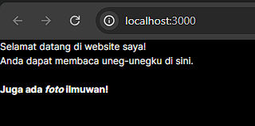
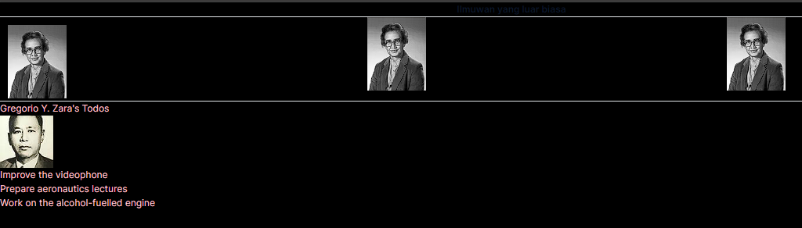
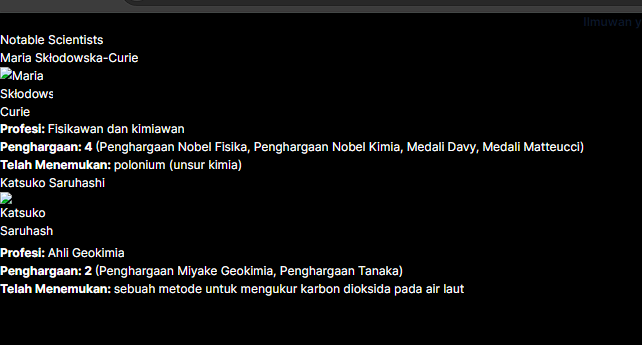

# Laporan Praktikum
|  | Pemrograman Berbasis Framework 2024 |
| ----------- | --------- |
| NIM | 2141720266 |
| Nama | Alfan Marcel Mulyawan |
| Kelas | TI-3A |

## Jawaban Soal 1

perlu menambahkan domain website imgur pada next.config.mjs supaya gambar dapat ditampilkan

## Jawaban Soal 2

membuat komponen baru yang bernama {Gallery} dimana isi komponen Gallery adalah memanggil komponen Profile sebanyak 3x dengan columns-3

## Jawaban Soal 3
kode yang benar

    export default function Bio() {
    return (
    

        

        <h1>Selamat datang di website saya!</h1>
        

        

            Anda dapat membaca uneg-unegku di sini.
              
            <b>Juga ada <i>foto</i> ilmuwan!</b>
        

    

    );
    }

## Jawaban Soal 4
kode yang benar

    const person = {
        name: 'Gregorio Y. Zara',
        theme: {
        backgroundColor: 'black',
        color: 'pink'
        }
    };
    
    export default function TodoList() {
        return (
        

            <h1>{person.name}'s Todos</h1>
            
            <ul>
            <li>Improve the videophone</li>
            <li>Prepare aeronautics lectures</li>
            <li>Work on the alcohol-fuelled engine</li>
            </ul>
        

        );
    }

dengan menambahkan .name pada {person} pada h1 karena dalam person hanya name yang belum dipanggil

## Jawaban Soal 5

    const person = {
        name: 'Gregorio Y. Zara',
        theme: {
        backgroundColor: 'black',
        color: 'pink'
        },
        img: "https://i.imgur.com/7vQD0fPs.jpg"
    };
    
    export default function TodoList() {
        return (
        

            <h1>{person.name}'s Todos</h1>
            
            <ul>
            <li>Improve the videophone</li>
            <li>Prepare aeronautics lectures</li>
            <li>Work on the alcohol-fuelled engine</li>
            </ul>
        

        );
    }

tidak ada perbedaan 

## Jawaban Soal 6
tidak ada perbedaan

    const baseUrl = 'https://i.imgur.com/';
    const person = {
    name: 'Gregorio Y. Zara',
    imageId: '7vQD0fP',
    imageSize: 's',
    theme: {
        backgroundColor: 'black',
        color: 'pink'
    }
    };

    export default function TodoList() {
    return (
        

        <h1>{person.name}'s Todos</h1>
        
        <ul>
            <li>Improve the videophone</li>
            <li>Prepare aeronautics lectures</li>
            <li>Work on the alcohol-fuelled engine</li>
        </ul>
        

    );
    }
pada bagian src tiap objek dijadikan satu objek dengan {} lalu menggabungkan tiap objek dengan + karena tiap objek memiliki tipe data sama string

## Jawaban Soal 7

